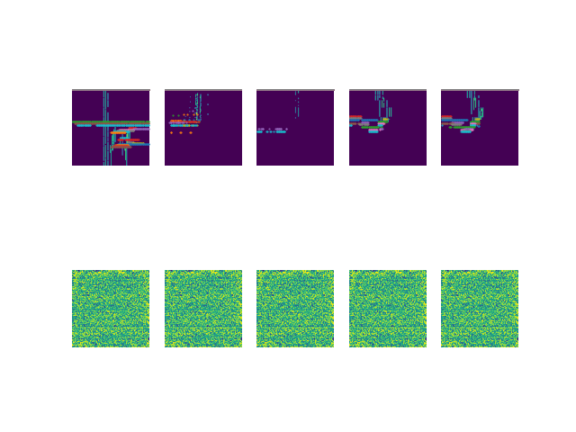
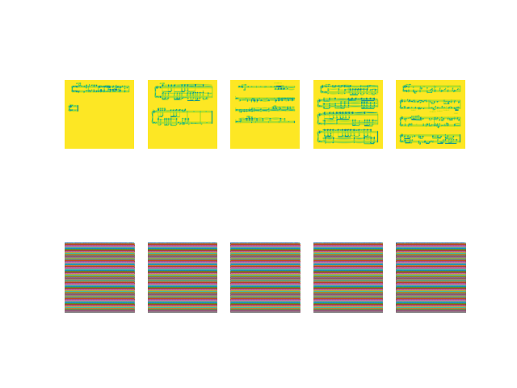
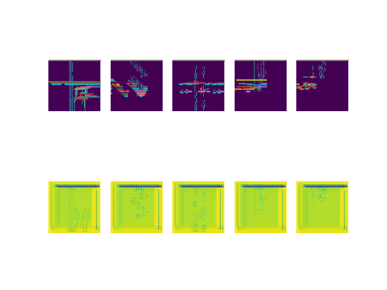
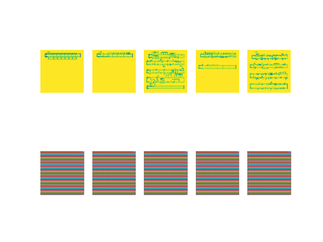

# 실행 환경

- PyCharm IDE
- Anaconda virtual environment (Python 3.7)

# Magenta 모델 설치, 실행 방법

## 1. 개발 환경 설정

``` pip install magenta ```

``` pip install rtmidi ``` 

``` git clone https://github.com/tensorflow/magenta.git ```

## 2. checkpoint 설치
- [piano model checkpoint](https://storage.googleapis.com/magentadata/models/onsets_frames_transcription/maestro_checkpoint.zip) which is trained on the MAESTRO dataset
- [drum model checkpoint](https://storage.googleapis.com/magentadata/models/onsets_frames_transcription/e-gmd_checkpoint.zip) which is trained on the E-GMD dataset

## 3. Magenta의 onesets_frames 모델 테스트

- 피아노, 드럼의 wav 파일을 midi 파일로 변환하는 모델

[0_1_args.py](0_1_args.py)
- midi file로 변환할 .wav 파일이 저장되어 있는 경로를 텍스트 파일로 저장 

[0_model_test.py](0_model_test.py)
- FLAGS config 값을 'onesets_frames' 또는 'drums'로 변경
- .wav 파일의 경로가 저장되어 있는 텍스트 파일의 경로 지정 
```python
FLAGS.config = 'drums' #'onsets_frames' : piano, 'drums' : drum
.
.
.
argv_path = './drum_Test.txt' # piano_Train, piano_Test, drum_Train, drum_Test
```
---
# 4. 미디를 악보화하는 방법

## midi_to_sheets.py를 사용합니다
```python
    # 미디 폴더를 지정
    midi_folder = "./Moon_test_folder/midi/"
    # 출력 폴더를 지정
    sheet_folder = "./Moon_test_folder/sheets"
    # MuseScore3.exe의 경로를 지정
    MuseScore3_exe_path = "C:/Program Files/MuseScore 3/bin/MuseScore3.exe"
```
파라미터를 수정하고 py를 실행하면 지정된 폴더의 midi 파일들이 MuseScore3에 의해 악보화 됩니다.

---

# 5. Web APPLICATION

Flask 웹 프레임워크를 사용하여 Web 어플리케이션 제작

- [app.py](./app.py): 어플리케이션 실행 파일
    - 로컬 호스트에서 실행(127.0.0.1:5000)
      ```python
      # 악보 이미지를 보여주는 웹페이지 랜더링
      @app.route('/view',methods=['GET','POST'])
      def view():
      
      # 업로드한 wav 파일을 악보 이미지로 생성해주는 프로세스
      @app.route('/loading/<filename>')
      def loading(filename):
      
        #onset_frames(piano) 모델을 사용하여 midi 파일 생성
        wav_to_midi(filename)
        
        #midi 파일의 악보를 이미지로 생성
        midi_to_sheet(midi, sheet, musescore_exe_path)
       
      # 인덱스에 맞는 악보 페이지를 웹페이지에 다시 출력하도록 함 
      @app.route('/view/<string:name>/<int:idx>')
      def view_sheet(name, idx):
      
      # 악보 이미지를 zip 파일로 다운로드할 수 있도록 함
      @app.route('/download/<string:filename>')
      def download(filename):
      ```
    - ※ [midi to sheet](./midi_to_sheet.py): ([MuseScore3](https://musescore.informer.com/download/?ca1afaf5) 설치 필요)


- [index.html](./templates/index.html): 어플리케이션 첫 페이지
    - 파일 업로드: .wav 파일 업로드

- [upload.html](./templates/upload.html): 파일 업로드 페이지
  - .wav 파일을 선택하고 변환 버튼을 누르면 악보 이미지 생성 
  - 악보 로딩 화면 추가

- [fail.html](./templates/fail.html): 파일 업로드 실패 시 실행 페이지

- [view.html](./templates/view.html): 파일 업로드 성공 시
  - 생성한 악보 이미지 출력
  - wav 파일 재생 가능
  - 악보 이미지 파일(png) 다운로드 가능
  - 악보가 여러 장일 때 이전 버튼과 다음 버튼을 클릭했을 때 이벤트 발생
    ```html
      <script type="text/javascript">
      document.getElementById("prev").addEventListener("click",prev);
      document.getElementById("next").addEventListener("click",next);
    
      <!-- 이전 버튼을 클릭했을 때 호출되는 함수 -->
      function prev(){
        이전 악보 이미지를 출력
      }
    
      <!-- 다음 버튼을 클릭했을 때 호출되는 함수 -->
      function next(){
        다음 악보 이미지를 출력
      }
      </script>
      ```
---
# 6. ~~CycleGAN~~

- CycleGAN 모델을 이용하여 midi 파일을 악보 이미지(png) 파일로 생성할 수 있도록 하려고 하였으나 학습이 제대로 이루어지지 않음

<div>
<p align="center">2600epochs</p>
<p align="center">6500epochs</p>
</div>

### Numpy Array Format으로 저장

[1_sheet_2_numpy.py](1_sheet_2_numpy.py)

- 악보 이미지를 grayscale 한 후 128x128 크기로 resize
- numpy 배열로 변환하여 .npy 파일로 저장

[1_1_midi_2_numpy.py](1_1_midi_2_numpy.py)

- midi 파일을 numpy 배열로 변환
- 악보 파일과 크기를 같게 resize하여 .npy 파일로 저장


[2_model_train.py](./2_model_train.py)

- cycleGAN 모델을 이용한 학습
    - generator_AtoB -> midi 파일을 악보 파일로 생성하는 것을 학습
    - generator_BtoA -> 악보 파일을 midi 파일로 생성하는 것을 학습
  
